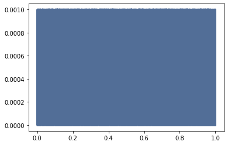
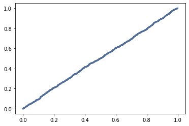

[Think Stats Chapter 4 Exercise 2](http://greenteapress.com/thinkstats2/html/thinkstats2005.html#toc41) (a random distribution)

This exercise has us testing the `numpy.random.random` function for uniformity.

The code is simple, generating 1000 random numbers and then using the author's Pmf and Cdf plotting methods:

```python
random_numbers = [np.random.random() for _ in range(1000)]

pmf = thinkstats2.Pmf(random_numbers)

thinkplot.Pmf(pmf)

cdf = thinkstats2.Cdf(random_numbers)

thinkplot.Cdf(cdf)
```

The straight line in the CDF shows that the data is indeed uniform



